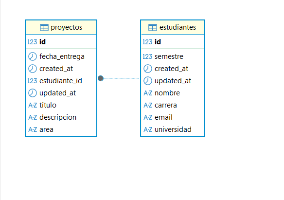

# STUDENTSREPO
 
[Una frase corta que resuma el propósito – máximo 15 palabras]
“Donde las ideas académicas se convierten en conocimiento compartido.”

## Introducción / Contexto

1. Descripción del problema

Actualmente, muchos proyectos académicos realizados por estudiantes quedan almacenados de manera aislada (en computadores personales, correos o plataformas cerradas), lo que dificulta su consulta, reutilización y retroalimentación.

Esto genera:

-Pérdida de conocimiento valioso.

-Baja visibilidad del trabajo estudiantil.

-Escasa colaboración entre estudiantes y docentes.

-Repetición de ideas o proyectos similares por falta de acceso a antecedentes.


2. Justificación: ¿por qué es relevante? (impacto social, académico, empresarial, etc.)  
3. Breve descripción del dominio / temática del proyecto integrador

## Objetivos

**Objetivo General**  
[Redactar el objetivo general del proyecto integrador – una frase clara y concreta]

**Objetivos Específicos**  
- [OE1 – descripción clara]  
- [OE2 – descripción clara]  
- [OE3 – descripción clara]  
- [OE4 – descripción clara]  
(Mínimo 3–5 objetivos específicos)

## Alcance del Proyecto (Scope)

**Qué se va a desarrollar:**  
- [Listar módulos principales y funcionalidades clave previstas en el semestre]

**Qué NO se va a desarrollar en esta versión (fuera de alcance):**  
- [Listar explícitamente lo que se excluye intencionalmente]

## Tecnologías y Herramientas (Tech Stack)

- **Backend**: Spring Boot [versión exacta], Java [17 o 21], Spring Data JPA, [PostgreSQL / MySQL / H2]  
- **Frontend**: [tecnología elegida – React / Angular / Vue / etc.]  
- **Base de datos**: [PostgreSQL en producción / H2 en desarrollo inicial / etc.]  
- **Otras herramientas**: Git, GitHub, [Docker si se usará más adelante], [Postman / Swagger], etc.

## Integrantes del Equipo

| Nombre                  | Rol principal              | Usuario GitHub     |
|-------------------------|----------------------------|--------------------|
| [Nombre 1]              | Líder / Backend            | @[usuario]         |
| [Nombre 2]              | Frontend Lead              | @[usuario]         |
| [Nombre 3]              | Backend / Base de datos    | @[usuario]         |
| [Nombre 4]              | [rol]                      | @[usuario]         |
| ...                     | ...                        | ...                |

## Diagrama de Clases del Dominio (v1)

  
*Diagrama inicial del modelo de dominio – versión 1. Se actualizará en futuras entregas.*

## Instrucciones de Instalación y Ejecución (para desarrolladores)

1. Clonar el repositorio
   ```bash
   git clone https://github.com/[usuario-lider]/[nombre-repo].git
